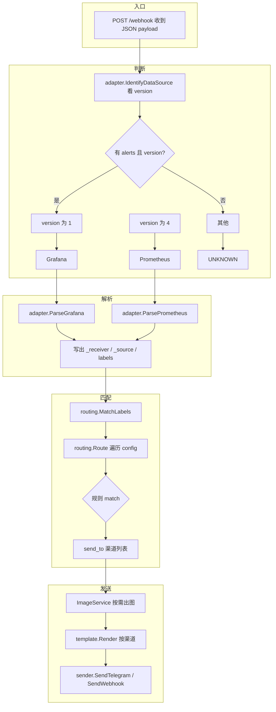
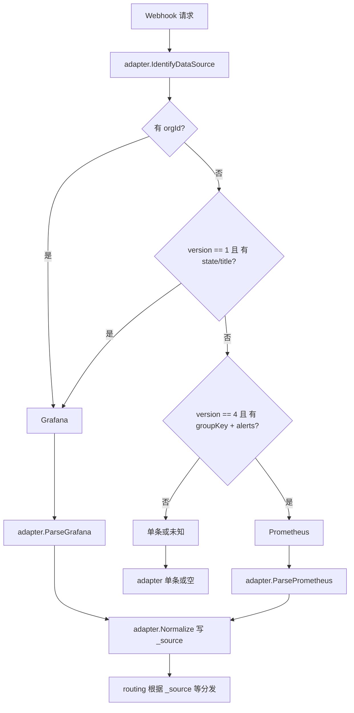
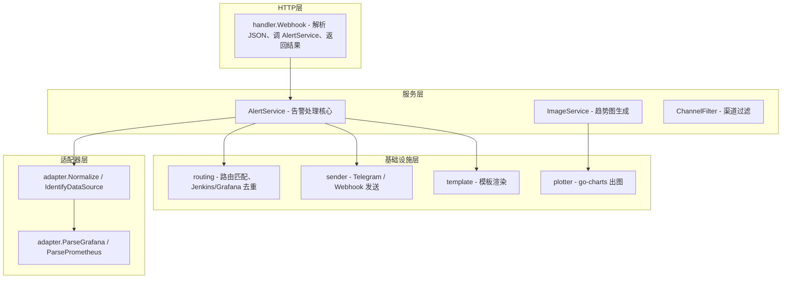
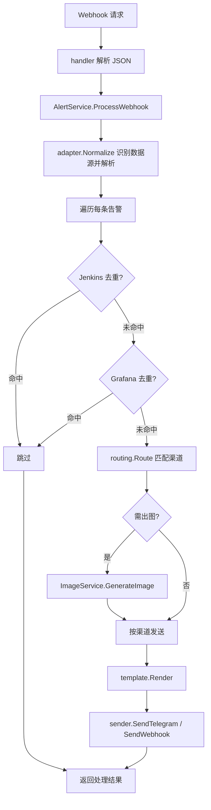
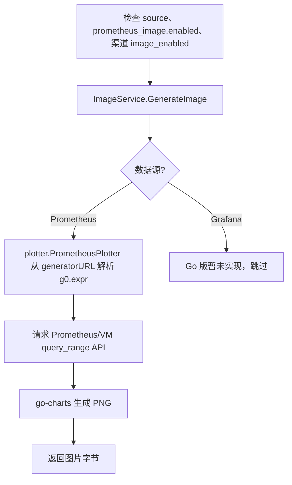

# webhook_alerts (Go)

告警路由服务：接收 Prometheus Alertmanager / Grafana Unified Alerting 的 Webhook，按配置路由到 Telegram、Slack 等渠道，并支持趋势图（**本版仅使用 vicanso/go-charts**，无 Plotly/Matplotlib）。

**目录**：[功能](#功能) · [配置](#配置) · [完整流程图](#完整流程图) · [构建与运行](#构建与运行) · [目录结构](#目录结构) · [指标说明](#指标说明)

## 功能

- 识别 Prometheus (version=4) 与 Grafana (version=1) Webhook，统一解析
- 按 `config.yaml` 路由规则匹配渠道，支持正则
- Jenkins / Grafana 去重
- 可选趋势图：从 generatorURL 解析 `g0.expr`，请求 Prometheus/VM query_range，用 **go-charts** 生成 PNG（dark/grafana 风格）
- Telegram / Slack (Webhook) 发送，连接池与重试
- Prometheus 指标：`/metrics` 暴露告警接收量、路由、发送成功/失败（按渠道）、出图、query_range 请求等

## 配置

通过环境变量 `CONFIG_FILE` 指定配置文件路径（默认当前目录 `config.yaml`）。**监听端口必须在 `config.yaml` 的 `server.port` 中配置，代码中无默认端口。**

### Go 版实际使用的配置项

| 区块 | 说明 |
|------|------|
| `server` | `host`、`port`（必填，端口仅由此读取） |
| `logging` | `log_dir`、`log_file`、`level`、`max_bytes`、`backup_count` |
| `proxy_enabled` / `proxy` | 全局代理开关及 http/https 代理地址 |
| `prometheus_image` | `enabled`、`prometheus_url`、`use_proxy`、`lookback_minutes`、`step`、`timeout_seconds`、`max_series`、`legend_label_whitelist`（图例白名单，预留） |
| `grafana_image` | 结构保留兼容，Go 版暂未实现 Grafana 出图 |
| `jenkins_dedup` / `grafana_dedup` | 去重开关与参数 |
| `routing` | 路由规则（match、channels、filters 等） |
| `channels` | 各渠道（telegram、webhook 等）配置 |

**说明：** `prometheus_image` 在 Go 版中**统一使用 go-charts 出图**。若配置中存在 `plot_engine`（如 plotly/matplotlib），仅为兼容旧配置，**Go 版会忽略该字段**。

### 与 Python 版差异（简要）

- **出图引擎**：Go 仅 go-charts；Python 支持 plotly/matplotlib。
- **端口**：Go 必须配置 `server.port`；Python 可有默认 9600。
- **模板**：Go 使用 `templates/*.tmpl`（Go template）；Python 使用 `.j2`（Jinja2）。

---

## 完整流程图

与 [alert-router-py](../alert-router-py) 逻辑一致（本仓库名为 webhook_alerts），以下为 Go 版代码层级与数据流。

### 1. 主流程：判断 → 解析 → 匹配 → 发送



### 2. 数据源识别流程



### 3. 系统架构分层



### 4. 告警处理端到端流程



### 5. 图片生成流程（Go 版：仅 Prometheus + go-charts）



---

## 构建与运行

**方式一：直接编译运行**

```bash
go build -o webhook_alerts ./cmd/alert-router
./webhook_alerts
```

**方式二：使用 scripts 脚本（推荐）**

```bash
# 本地编译
./scripts/build.sh

# 或交叉编译 Linux 二进制
./scripts/build-linux.sh

# 启动 / 停止 / 重启 / 状态 / 日志（与 Py 版 scripts/start.sh 用法一致）
./scripts/start.sh start
./scripts/start.sh stop    # 发送 SIGTERM，进程内优雅关闭
./scripts/start.sh restart
./scripts/start.sh status
./scripts/start.sh logs
```

需在 `config.yaml` 中配置 `server.port`。进程收到 **SIGTERM/SIGINT** 时会优雅退出（等待当前请求处理完毕，最多 30 秒）。启动后提供：

- `POST /webhook` — 告警入口
- `GET /health` — 健康检查
- `GET /metrics` — Prometheus 指标

## 目录结构

- `scripts/` — `start.sh`（启停/重启/状态/日志）、`build.sh`（本地编译）、`build-linux.sh`（Linux amd64 交叉编译）
- `cmd/alert-router` — 入口
- `internal/config` — 配置与 Channel 模型
- `internal/adapter` — 数据源解析（Prometheus/Grafana/单条）
- `internal/routing` — 路由匹配与去重
- `internal/service` — AlertService、ImageService、ChannelFilter
- `internal/plotter` — Prometheus 趋势图（go-charts）
- `internal/sender` — Telegram / Webhook 发送
- `internal/template` — 模板渲染与时间/链接过滤
- `internal/handler` — HTTP 处理（webhook、metrics）
- `internal/logger` — 结构化日志与 trace_id
- `internal/metrics` — Prometheus 指标定义
- `templates/` — 模板（.tmpl，对应 py 的 .j2）

## 指标说明

- `webhook_alerts_alerts_received_total{source,status}` — 接收告警数
- `webhook_alerts_alerts_routed_total{channel}` — 路由到渠道次数
- `webhook_alerts_alerts_sent_total{channel,status}` — 发送结果（success/failure）
- `webhook_alerts_alerts_send_failures_total{channel,reason}` — 发送失败原因
- `webhook_alerts_alerts_dedup_skipped_total{type}` — 去重跳过
- `webhook_alerts_image_generated_total{source,status}` — 出图次数
- `webhook_alerts_prometheus_requests_total{status}` — query_range 请求
- `webhook_alerts_webhook_requests_total{status}` — Webhook 请求数
